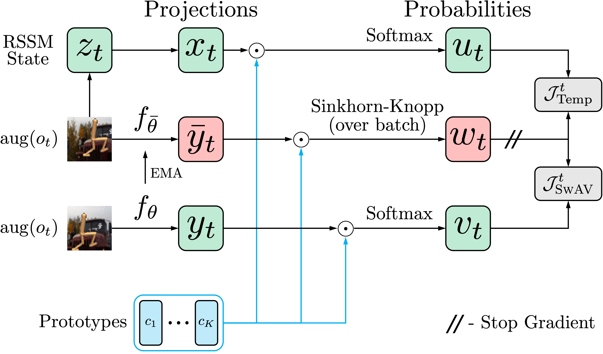
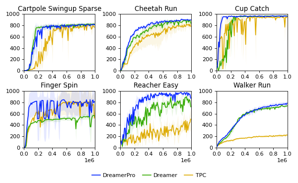

# DreamerPro

This is the official implementation of [DreamerPro: Reconstruction-Free Model-Based Reinforcement Learning with Prototypical Representations](https://arxiv.org/abs/2110.14565) in TensorFlow 2. A re-implementation of [Temporal Predictive Coding for Model-Based Planning in Latent Space](https://github.com/VinAIResearch/TPC-tensorflow) is also included.

DreamerPro makes large performance gains on the [DeepMind Control suite](https://github.com/deepmind/dm_control) both in the standard setting and when there are complex background distractions. This is achieved by combining [Dreamer](https://github.com/danijar/dreamerv2) with [prototypical representations](https://github.com/facebookresearch/swav) that free the world model from reconstructing visual details.

<p align="center">
  
</p>

## Setup

### Dependencies
First clone the repository, and then set up a conda environment with all required dependencies using the `requirements.txt` file:
```shell
git clone https://github.com/fdeng18/dreamer-pro.git
cd dreamer-pro
conda create --name dreamer-pro python=3.8 conda-forge::cudatoolkit conda-forge::cudnn
conda activate dreamer-pro
pip install --upgrade pip
pip install -r requirements.txt
```
DreamerPro has not been tested on Atari, but if you would like to try, the Atari ROMs can be imported by following these [instructions](https://github.com/openai/atari-py#roms).

### Natural background videos
Our natural background setting follows [TPC](https://github.com/VinAIResearch/TPC-tensorflow). For convenience, we have included their code to download the background videos. Simply run:
```shell
python download_videos.py
```
This will download the background videos into `kinetics400/videos`.

## Training

### DreamerPro
For standard DMC, run:
```shell
cd DreamerPro
python dreamerv2/train.py --logdir log/dmc_{task}/dreamer_pro/{run} --task dmc_{task} --configs defaults dmc norm_off
```
Here, `{task}` should be replaced by the actual task, and `{run}` should be assigned an integer indicating the independent runs of the same model on the same task. For example, to start the first run on `walker_run`:
```shell
cd DreamerPro
python dreamerv2/train.py --logdir log/dmc_walker_run/dreamer_pro/1 --task dmc_walker_run --configs defaults dmc norm_off
```
For natural background DMC, run:
```shell
cd DreamerPro
python dreamerv2/train.py --logdir log/nat_{task}/dreamer_pro/{run} --task nat_{task} --configs defaults dmc reward_1000
```

### TPC
DreamerPro is based on a [newer version](https://github.com/danijar/dreamerv2/tree/e783832f01b2c845c195587158c4e129edabaebb) of Dreamer. For fair comparison, we re-implement TPC based on the same version. Our re-implementation obtains better results in the natural background setting than reported in the original TPC [paper](https://arxiv.org/abs/2106.07156).

For standard DMC, run:
```shell
cd TPC
python dreamerv2/train.py --logdir log/dmc_{task}/tpc/{run} --task dmc_{task} --configs defaults dmc
```
For natural background DMC, run:
```shell
cd TPC
python dreamerv2/train.py --logdir log/nat_{task}/tpc/{run} --task nat_{task} --configs defaults dmc reward_1000
```

### Dreamer
For standard DMC, run:
```shell
cd Dreamer
python dreamerv2/train.py --logdir log/dmc_{task}/dreamer/{run} --task dmc_{task} --configs defaults dmc
```
For natural background DMC, run:
```shell
cd Dreamer
python dreamerv2/train.py --logdir log/nat_{task}/dreamer/{run} --task nat_{task} --configs defaults dmc reward_1000 --precision 32
```
We find it necessary to use `--precision 32` in the natural background setting for numerical stability.

## Outputs

The training process can be monitored via TensorBoard. We have also included performance curves in `plots`. Note that these curves may appear different from what is shown in TensorBoard. This is because the evaluation return in the performance curves is averaged over 10 episodes, while TensorBoard only shows the evaluation return of the last episode.

## Results

Standard DMC
<p align="center">
  
</p>

Natural Background DMC
<p align="center">
  
</p>

## Acknowledgments

This repository is largely based on the TensorFlow 2 implementation of [Dreamer](https://github.com/danijar/dreamerv2). We would like to thank [Danijar Hafner](https://danijar.com/) for releasing and updating his clean implementation. In addition, we also greatly appreciate the help from [Tung Nguyen](https://tung-nd.github.io/) in implementing TPC.

## Citation
```
@inproceedings{deng2022dreamerpro,
  title={Dreamerpro: Reconstruction-free model-based reinforcement learning with prototypical representations},
  author={Deng, Fei and Jang, Ingook and Ahn, Sungjin},
  booktitle={International Conference on Machine Learning},
  pages={4956--4975},
  year={2022},
  organization={PMLR}
}
```
